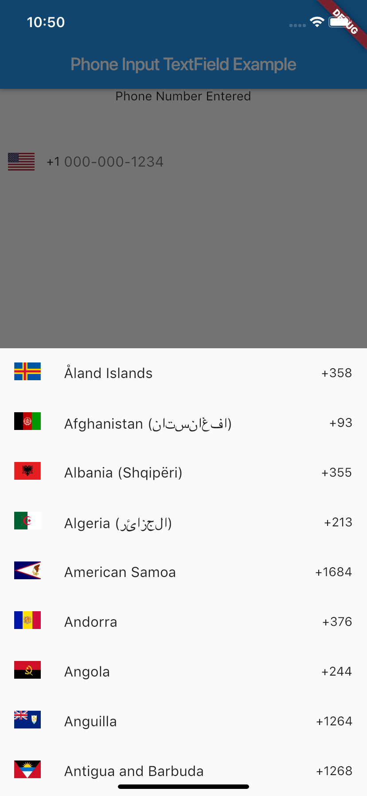
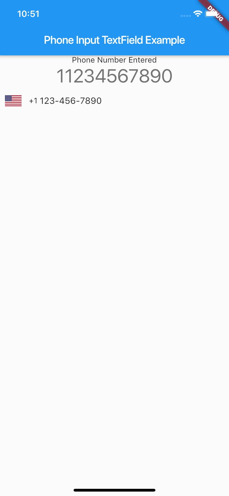
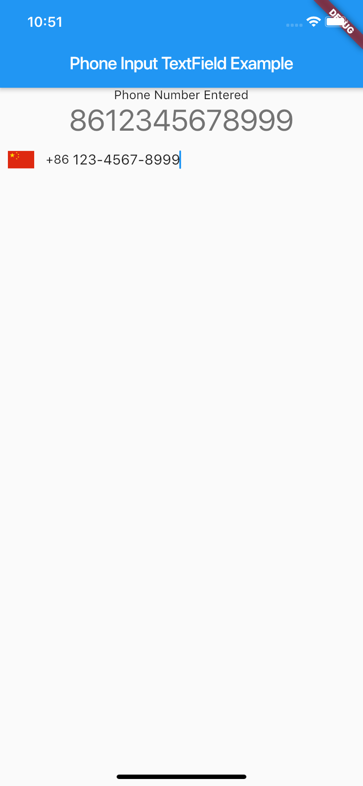

# phone_input_text_field

A Flutter widget for input phone number.

## Screenshoot






## Getting Started

In your flutter project add the dependency:

```yml
dependencies:
  ...
  phone_input_text_field: ^0.0.1
```

For help getting started with Flutter, view the online [documentation](https://flutter.io/).

## How to use
Import `phone_input_text_field.dart`

```dart
import 'package:phone_input_text_field/phone_input_text_field.dart';
```
All it needs is a callback function
```dart
/// 
/// Callback type define
/// Called when textcontroller get whole phone number
///
typedef void OnPhoneNumberComplete(String phoneNum);
```

Then the phone input textfield can be easily used as a widget.
```dart
PhoneInputTextField(onPhoneNumComplete: (String phoneNum) {
    //do what ever you want with phoneNum
});
```
### Future Plans
- [ ] Change default country support
- [ ] Search countries
- [ ] TextField style
- [ ] Country picker style
- [ ] Include or exclude countries
And more...

### Conception
This package is inspired by
https://github.com/chronotruck/FlagPhoneNumber

